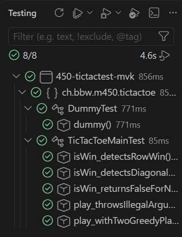
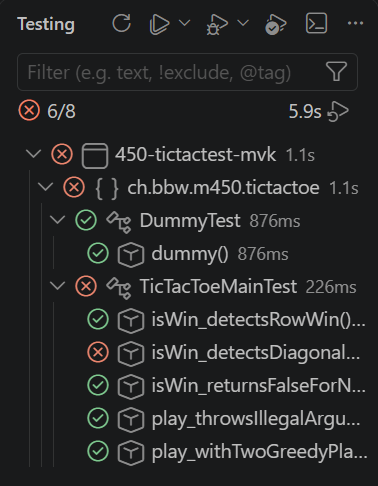

# Testdokumentation

Diese Datei dokumentiert die vorhandenen Unit-Tests nach dem **Given-When-Then**-Muster.

- **Given**: Ausgangszustand / Voraussetzungen
- **When**: die auszuführende Aktion
- **Then**: das erwartete Ergebnis

---

## `TicTacToeMainTest`

Quelle: [`src/test/java/ch/bbw/m450/tictactoe/TicTacToeMainTest.java`](../src/test/java/ch/bbw/m450/tictactoe/TicTacToeMainTest.java)

### `isWin_detectsRowWin`

| | |
|---|---|
| **Given** | Ein Brett, auf dem die oberste Reihe (Felder 0, 1, 2) vollständig mit `CROSS` besetzt ist. |
| **When** | `TicTacToeMain.isWin(board, ...)` für `CROSS` und für `CIRCLE` aufgerufen wird. |
| **Then** | `isWin` liefert `true` für `CROSS` und `false` für `CIRCLE`. |

### `isWin_detectsDiagonalWin`

| | |
|---|---|
| **Given** | Ein Brett, auf dem die Diagonale (Felder 0, 4, 8) vollständig mit `CROSS` besetzt ist. |
| **When** | `TicTacToeMain.isWin(board, Stone.CROSS)` aufgerufen wird. |
| **Then** | `isWin` liefert `true`. |

### `isWin_returnsFalseForNonWinningBoard`

| | |
|---|---|
| **Given** | Ein vollständig gefülltes Brett ohne Dreier-Reihe für `CROSS` oder `CIRCLE` (unentschieden). |
| **When** | `TicTacToeMain.isWin(board, ...)` für `CROSS` und für `CIRCLE` aufgerufen wird. |
| **Then** | `isWin` liefert für beide Farben `false`. |

### `play_throwsIllegalArgumentException_whenSamePlayerInstanceUsedForBothSides`

| | |
|---|---|
| **Given** | Eine einzelne `GreedyPlayer`-Instanz. |
| **When** | `TicTacToeMain.play(player, player)` mit derselben Instanz für X und O aufgerufen wird. |
| **Then** | Es wird eine `IllegalArgumentException` geworfen. |

### `play_withTwoGreedyPlayers_producesDeterministicCrossWin`

| | |
|---|---|
| **Given** | Zwei unabhängige `GreedyPlayer`-Instanzen, die stets das erste freie Feld belegen. |
| **When** | `TicTacToeMain.play(new GreedyPlayer(), new GreedyPlayer())` ausgeführt wird. |
| **Then** | Das Spiel endet deterministisch mit einem Sieg von `CROSS` (Anti-Diagonale 2-4-6). |

---

## `DummyTest`

Quelle: [`src/test/java/ch/bbw/m450/tictactoe/DummyTest.java`](../src/test/java/ch/bbw/m450/tictactoe/DummyTest.java)

### `dummy`

| | |
|---|---|
| **Given** | Keine Vorbedingungen (reiner Sanity-Check des Test-Setups). |
| **When** | `1 + 1` berechnet wird. |
| **Then** | Das Ergebnis ist `2`. |

---

## Testläufe (Screenshots)

Alle 8 Tests grün: die Testklassen `DummyTest` und `TicTacToeMainTest` laufen vollständig durch (8/8, 4.6s).

Nach einem absichtlich eingebauten Bug in `isWin` (falscher Index in der Gegendiagonale-Prüfung) schlägt `isWin_detectsDiagonalWin` fehl, alle übrigen Tests bleiben grün (6/8).
